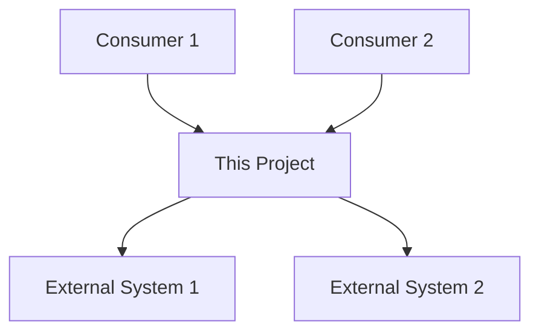

# Requirements and Product Documentation Generator Prompt

> **Purpose**: Copy and paste this prompt into Kiro (or any AI coding assistant) to generate requirements documentation for any software project. The AI will analyze the codebase, business logic, external integrations, and existing documentation to produce a document that captures the "why" behind each module — the business justification, regulatory requirements, and functional specifications.
>
> **Standards**: Follows [IEEE 830 SRS](https://standards.ieee.org/ieee/830/1222/) structure adapted for modern agile projects, and your organization's internal documentation standards.

---

## The Prompt

```
I need you to generate Requirements Documentation for this project. This document should capture the business justification, functional requirements, and non-functional requirements for each module — the "why" behind the code. This is especially valuable for projects where original requirements documents were never created or have been lost. Follow the process below systematically.

## Phase 1: Requirements Discovery (Do This First — Report Before Writing)

Analyze the project and report findings. I will confirm before you begin writing.

### 1.1 Business Context

Determine:
- **Project purpose**: What business problem does this project solve?
- **Target users**: Who uses this software and in what role?
- **Regulatory context**: Is this project driven by regulatory requirements? (insurance, finance, healthcare, etc.)
- **Organizational context**: What department/team owns this? What larger system is it part of?
- **Business criticality**: How critical is this to operations? What happens if it's down?

### 1.2 Functional Requirements (Reverse-Engineered)

For each module/component, derive requirements from the code:
- **What it does**: Core functionality (from code analysis)
- **Why it exists**: Business justification (from naming, comments, architecture docs, commit history)
- **Who uses it**: Which users or systems interact with it
- **Business rules**: Validation logic, decision trees, state machines embedded in code
- **Data requirements**: What data it processes, stores, or transforms

### 1.3 Non-Functional Requirements (Reverse-Engineered)

Derive from code, configuration, and architecture:
- **Performance**: Timeouts, caching, connection pooling, batch sizes
- **Security**: Authentication, authorization, encryption, input validation, audit logging
- **Availability**: Failover behavior, retry logic, circuit breakers
- **Scalability**: Session scope, application scope, thread safety
- **Compliance**: Regulatory requirements reflected in the code (disclaimer acceptance, audit trails, data retention)

### 1.4 Integration Requirements

For each external system:
- **What it provides**: Data or service consumed
- **Why it's needed**: Business reason for the integration
- **Contract**: API contract, data format, authentication method
- **SLA expectations**: Timeout settings, retry behavior, fallback behavior

### 1.5 Constraints and Assumptions

Identify:
- **Technology constraints**: Language version, framework version, server requirements
- **Organizational constraints**: Deployment process, approval gates, team structure
- **Assumptions**: What the code assumes about its environment (e.g., LDAP is always available, Vault has valid credentials)
- **Known limitations**: Features that are incomplete, workarounds in place, technical debt

### 1.6 Existing Requirements Artifacts

Check for:
- **Existing requirements docs**: SRS, PRD, user stories in issue tracker
- **Architecture docs**: Requirements implied by architecture decisions
- **Commit messages**: JIRA/ticket references that link to original requirements
- **README sections**: Business context, migration notes, design decisions

**STOP HERE. Report all findings and wait for my confirmation before proceeding to Phase 2.**

## Phase 2: Generate Requirements Documentation

After confirmation, generate the document with the following structure. Skip sections that don't apply.

### Document Structure

```markdown
# Requirements Documentation — [Project Name]

## Overview

### Purpose

[2-3 sentences: What business problem this project solves and why it exists.]

### Scope

[What this project covers and what it explicitly does not cover.]

### Target Users

| User Role | Description | Key Interactions |
|-----------|-------------|-----------------|
| [Role] | [Who they are] | [What they do with this system] |

### Regulatory Context

[If applicable: What regulations, compliance requirements, or legal obligations drive this project's features.]

### System Context

[Where this project fits in the larger system landscape — what it depends on and what depends on it.]



---

## Functional Requirements

### Module: [Module Name]

#### FR-[ID]: [Requirement Title]

**Priority**: [Must Have / Should Have / Nice to Have]
**Status**: [Implemented / Partially Implemented / Planned]

**Description**: [What the system must do — written as a requirement statement]

**Business Justification**: [Why this requirement exists — the business need it addresses]

**Acceptance Criteria**:
- [ ] [Criterion 1 — specific, testable condition]
- [ ] [Criterion 2]
- [ ] [Criterion 3]

**Business Rules**:
- [Rule 1: specific business logic embedded in the code]
- [Rule 2]

**Source**: [Where this requirement was derived from — code analysis, architecture docs, commit history, ticket reference]

---

[Repeat for each functional requirement in each module]

---

## Non-Functional Requirements

### NFR-[ID]: [Requirement Title]

**Category**: [Performance / Security / Availability / Scalability / Compliance / Usability]
**Priority**: [Must Have / Should Have / Nice to Have]

**Description**: [What quality attribute the system must exhibit]

**Measurable Criteria**: [How to verify this requirement is met — specific metrics or thresholds]

**Implementation**: [How this is currently implemented in the code — brief reference]

**Source**: [Where this requirement was derived from]

---

[Repeat for each non-functional requirement]

---

## Integration Requirements

### IR-[ID]: [External System Name]

**System**: [External system name and type]
**Direction**: [Inbound / Outbound / Bidirectional]
**Protocol**: [REST, JDBC, CLI, LDAP, etc.]

**Business Purpose**: [Why this integration exists]

**Data Exchanged**:
| Data Element | Direction | Format | Description |
|-------------|-----------|--------|-------------|
| [element] | [in/out] | [format] | [description] |

**Authentication**: [How authentication works — method, not credentials]

**Error Handling**: [What happens when this integration fails]

**Source**: [Where this requirement was derived from]

---

[Repeat for each integration]

---

## Constraints

### Technical Constraints

| Constraint | Description | Impact |
|-----------|-------------|--------|
| [Constraint] | [Description] | [How it affects the project] |

### Organizational Constraints

| Constraint | Description | Impact |
|-----------|-------------|--------|
| [Constraint] | [Description] | [How it affects the project] |

---

## Assumptions

| ID | Assumption | Risk if Invalid |
|----|-----------|-----------------|
| A-1 | [Assumption] | [What breaks if this assumption is wrong] |

---

## Traceability Matrix

| Requirement | Module/Class | Test | Architecture Doc |
|-------------|-------------|------|-----------------|
| FR-1 | [Class] | [Test class] | [Doc reference] |
| FR-2 | [Class] | [Test class] | [Doc reference] |
| NFR-1 | [Implementation] | [Test class] | [Doc reference] |

---

## Glossary

| Term | Definition |
|------|-----------|
| [Term] | [Definition in the context of this project] |

---

*Last Updated: [DATE]*
```

## Phase 3: Validation

After generating the document, verify:

### Requirements Documentation Validation
- [ ] Every module has at least one functional requirement
- [ ] Requirements are written as testable statements (not vague descriptions)
- [ ] Business justification is provided for each requirement
- [ ] Acceptance criteria are specific and verifiable
- [ ] Non-functional requirements have measurable criteria
- [ ] Integration requirements cover all external systems from the integration map
- [ ] Constraints and assumptions are realistic (derived from actual code)
- [ ] Traceability matrix links requirements to code and tests
- [ ] Glossary covers domain-specific terms
- [ ] No secrets or sensitive data appear anywhere
- [ ] Sources are cited for reverse-engineered requirements

## Rules

1. **Reverse-engineer from code** — derive requirements from what the code actually does
2. **Read architecture docs** — they provide context for why things were built this way
3. **Read commit history** — ticket references link to original requirements
4. **Read test cases** — tests often encode requirements as assertions
5. **Don't invent requirements** — only document what the code actually implements
6. **Flag uncertainty** — if you can't determine the business justification, say so
7. **Use requirement IDs** — every requirement gets a unique ID for traceability
8. **Write testable statements** — "The system must..." not "The system should try to..."
9. **Pause for confirmation** — after Phase 1 analysis, stop and wait before writing

## Reference Files

When generating this document, consult these project files if they exist:
- `README.md` — Project overview, business context, consumer projects
- `docs/architecture/01-module-inventory.md` — Module purposes and relationships
- `docs/architecture/02-endpoint-catalog.md` — Public API surface (functional requirements)
- `docs/architecture/03-schema-catalog.md` — Data models (data requirements)
- `docs/architecture/04-data-flow-maps.md` — Data flows (integration requirements)
- `docs/architecture/05-security-architecture.md` — Security requirements
- `docs/architecture/06-integration-map.md` — External systems (integration requirements)
- `docs/architecture/07-configuration-analysis.md` — Configuration (non-functional requirements)
- `docs/architecture/09-business-workflows.md` — Business workflows (functional requirements)
- `src/main/` — Source code for reverse-engineering requirements
- `src/test/` — Tests that encode requirements as assertions
- `CHANGELOG.md` — Feature history and ticket references

## Organization Standards Reference

Standards and templates are maintained in your organization's standards repository (set its location for your team). Referenced files:
- `steering/security-standards.md` — Security requirements (OWASP, NIST)
- `steering/story-writing.md` — INVEST principles for writing requirements as user stories
- `steering/epic-writing.md` — Epic hierarchy for organizing requirements
```

---

## Usage Notes

### How to Use This Prompt

1. Open any project in your AI coding assistant
2. Copy the entire prompt above (everything between the outer triple backticks)
3. Paste it into the chat
4. Optionally add: "Focus on the [module name] module" to scope the work
5. The AI will analyze the codebase, report findings, and wait for confirmation
6. After confirmation, it generates the requirements documentation

### Output Location

| Output | Suggested Location |
|---|---|
| Requirements Documentation | `docs/requirements/requirements.md` or `docs/REQUIREMENTS.md` |

### Relationship to Other Prompts

- **README & Changelog prompt** (`docs/prompts/readme-changelog-generator-prompt.md`) — README provides project context; this provides the detailed requirements
- **Test Strategy prompt** (`docs/prompts/test-strategy-prompt.md`) — Tests verify requirements; the traceability matrix links them
- **This prompt** — Generates the business justification and functional/non-functional requirements

### When to Use This Prompt

This prompt is most valuable for:
- **Legacy projects** where original requirements were never documented or have been lost
- **Shared libraries** where consumers need to understand the contract and business rules
- **Regulatory projects** where compliance requires documented requirements
- **Onboarding** where new team members need to understand the "why" behind the code

---

**Last Updated**: 2026-04-23 (CST)
