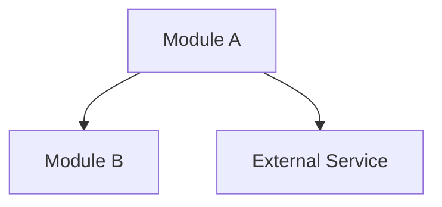

# README & Changelog Generator Prompt

> **Purpose**: Copy and paste this prompt into Kiro (or any AI coding assistant) to generate a professional README.md and CHANGELOG.md for any project, regardless of tech stack. The AI will analyze the project, pull from git history, and produce both files following industry best practices.
>
> **Standards**: README follows [Make a README](https://www.makeareadme.com/) and [Best-README-Template](https://github.com/othneildrew/Best-README-Template) conventions. Changelog follows [Keep a Changelog v1.1.0](https://keepachangelog.com/en/1.1.0/) and [Semantic Versioning 2.0.0](https://semver.org/spec/v2.0.0.html).

---

## The Prompt

```
I need you to generate a comprehensive README.md and CHANGELOG.md for this project. Follow the process below systematically.

## Phase 1: Project Analysis (Do This First — Report Before Writing)

Analyze the project and report findings. I will confirm before you begin writing.

### 1.1 Project Identity

Determine:
- **Project name**: From package manifest (pom.xml, package.json, Cargo.toml, pyproject.toml, go.mod, etc.) or directory name
- **Description**: From manifest description field, existing README, or inferred from code
- **Version**: From manifest, tags, or CI/CD config
- **License**: From LICENSE file or manifest
- **Repository URL**: From manifest SCM section, git remote, or .git/config
- **Issue tracker**: From manifest or CI/CD config
- **Team/owner**: From manifest, CI/CD config, or CODEOWNERS file

### 1.2 Tech Stack Detection

Scan the project to identify:
- **Language & version**: Java, TypeScript, Python, Go, Rust, C/C++, etc. (check compiler settings, toolchain files, or CI config for version)
- **Framework**: Spring Boot, Angular, React, Django, Express, etc.
- **Build system**: Maven, Gradle, npm, yarn, pip, Cargo, Make, CMake, etc.
- **Test framework**: JUnit, Jest, pytest, Go test, Catch2, etc.
- **Code quality**: SonarQube, ESLint, Spotless, Checkstyle, etc.
- **Code coverage**: Jacoco, Istanbul/nyc, coverage.py, etc.
- **CI/CD**: GitLab CI, GitHub Actions, Jenkins, etc.
- **Infrastructure**: Docker, Kubernetes, Helm, Terraform, etc.
- **Databases**: PostgreSQL, MongoDB, Redis, Snowflake, etc.
- **Key dependencies**: List all significant dependencies with versions from the manifest

### 1.3 Project Type Classification

Determine what kind of project this is:
- **Application** (has entry point, runs standalone)
- **Library/SDK** (consumed as dependency by other projects)
- **Service/API** (exposes endpoints)
- **CLI tool** (command-line interface)
- **UI application** (Angular, React, Vue — has visual interface)
- **Infrastructure** (IaC, Helm charts, pipelines)
- **Monorepo** (multiple packages/modules with independent versioning)

This classification determines which README sections are relevant and how the changelog is structured.

### 1.4 Git History Analysis

Run these commands and analyze the output:
```bash
# Full commit log with authors
git log --pretty=format:"%H|%an|%ae|%ad|%s" --date=short --all

# All tags (versions)
git tag -l --sort=-version:refname

# Tag details (date, author, hash for each tag)
for tag in $(git tag -l --sort=-version:refname); do
  date=$(git log -1 --format="%ad" --date=short "$tag")
  author=$(git log -1 --format="%an" "$tag")
  hash=$(git rev-list -1 "$tag" | cut -c1-8)
  echo "$tag|$date|$author|$hash"
done

# First-parent history on main/master branch
git log --pretty=format:"%h|%an|%ad|%s" --date=short --first-parent main

# Contributors summary
git shortlog -sne --all
```

From the git history, extract:
- All tagged versions with dates and authors
- All contributors with email and active periods
- Commits grouped by version/tag
- JIRA/issue references in commit messages (patterns: PROJ-123, #123, TP-12345)
- Breaking changes (look for "BREAKING", major version bumps, "!" in conventional commits)
- Security scan remediation commits (look for "fortify", "security", "vulnerability", "CVE")
- SVN migration markers (look for "git-svn-id" in commit messages — indicates SVN-to-Git migration)

### 1.5 Existing Documentation Check

Check for:
- Existing README.md (preserve any manually written content worth keeping — migration notes, design decisions, etc.)
- Existing CHANGELOG.md or HISTORY.md
- docs/ directory with architecture documentation
- CONTRIBUTING.md
- CODE_OF_CONDUCT.md
- LICENSE or COPYRIGHT files
- Screenshots, diagrams, or demo assets

### 1.6 Related Projects Detection

Check for references to related projects:
- Dependencies that share the same group/org namespace
- Projects referenced in the manifest SCM section, CI/CD config, or existing docs
- Consuming projects mentioned in README or comments

**STOP HERE. Report all findings and wait for my confirmation before proceeding to Phase 2.**

## Phase 2: Generate README.md

After confirmation, generate README.md with the following structure. Skip sections that don't apply to this project type. For READMEs longer than ~100 lines, include a Table of Contents.

### README Structure

```markdown
# Project Name

[badges — see badge guidelines below]

## Table of Contents

[Auto-generate from headers. Include for any README over ~100 lines.]

- [Overview](#overview)
- [Getting Started](#getting-started)
- [Architecture Documentation](#architecture-documentation)
- [Testing](#testing)
- [Deployment](#deployment)
- [Troubleshooting](#troubleshooting)
- [Contributing](#contributing)
- [License](#license)
- [Contact](#contact)

## Overview

[2-3 sentence description of what this project does, who it's for, and why it exists.]

### Key Capabilities

[Bullet list of the main things this project provides — derived from actual code analysis, not guesses.]

### Tech Stack

[Table: Component | Technology | Version | Purpose]

### Architecture Overview

[If the project has 3+ modules or components, include a Mermaid diagram showing the high-level structure. Keep it simple — modules, their relationships, and external systems. Use default Mermaid theme only (no custom theming).]



---

## Getting Started

### Prerequisites

[List everything that must be installed before building/running. Be specific about versions.]

- Language runtime (e.g., Java 17, Node.js 20, Python 3.11)
- Build tool (e.g., Maven 3.9+, npm 10+)
- Other tools (e.g., Docker, specific CLI tools)

### Installation / Build

[Step-by-step commands to clone, install dependencies, and build.]

```bash
git clone <repository-url>
cd <project-name>
<build-command>  # e.g., mvn clean package, npm install, cargo build
```

### Running

[How to run the application/tests/service — adapt based on project type.]

- **For applications**: How to start it, what URL to open
- **For libraries**: Skip this section — use "Usage" instead
- **For services**: How to start the server, health check endpoint
- **For CLI tools**: How to invoke commands with examples

### Usage (Libraries only)

[For libraries/SDKs: show the dependency coordinates and a minimal usage example.]

**Maven**:
```xml
<dependency>
    <groupId>com.example</groupId>
    <artifactId>my-library</artifactId>
    <version>X.Y.Z</version>
</dependency>
```

**Gradle**:
```groovy
implementation 'com.example:my-library:X.Y.Z'
```

**npm**:
```bash
npm install my-library
```

[Then show a minimal code example of the most common use case.]

### Configuration

[Environment variables, config files, profiles — with example values, NEVER real secrets. Use placeholders like `<your-api-key>` or `secret/path/to/credentials`.]

### Screenshots / Demo (UI projects only)

[For Angular, React, Vue, or any project with a visual interface: include screenshots, GIFs, or a link to a live demo. Place these early in the README — visuals are the fastest way to communicate what a UI project does.]

---

## Architecture Documentation

[If docs/architecture/ exists, list each document with a 1-2 sentence summary and link. Format as a numbered list with document title as a link and summary below.]

### [01 — Document Title](docs/architecture/01-document.md)
One-sentence summary of what this document covers.

### [02 — Document Title](docs/architecture/02-document.md)
One-sentence summary of what this document covers.

---

## Testing

[How to run tests, what test frameworks are used, any special setup needed.]

```bash
# Run all tests
<test-command>  # e.g., mvn test, npm test, pytest

# Run specific test category (if applicable)
<specific-test-command>
```

[Mention code coverage if available — how to generate reports, what the current target is.]

---

## Deployment

[CI/CD pipeline description, deployment targets, release process — if applicable.]

---

## Troubleshooting

[Common issues and their solutions. Include problems a new developer would likely hit during setup or first run. Format as problem/solution pairs.]

### Problem: [Description]
**Solution**: [Steps to fix]

### Problem: [Description]
**Solution**: [Steps to fix]

---

## Related Projects

[List projects that consume this library, sibling projects in the same ecosystem, or upstream dependencies that are organizationally related.]

| Project | Relationship | Description |
|---------|-------------|-------------|
| [project-name](url) | Consumer / Sibling / Parent | Brief description |

---

## Contributing

[Link to CONTRIBUTING.md if it exists, or brief contribution guidelines.]

---

## License

[One-line license statement with link to LICENSE file. Match the actual license in the repo.]

This project is licensed under the [LICENSE_TYPE](LICENSE) license.

---

## Contact

[Team name, email, repository URL, issue tracker.]
```

### Badge Guidelines

Place badges on the first line after the project title. Include only badges that are real and verifiable. Target 4-7 badges.

**Always include (if applicable):**
- Pipeline/build status (from CI/CD platform — use the project's actual URL)
- Language and version
- Framework and version
- Build tool
- Test framework
- License (link to LICENSE file)

**Include if available:**
- Code coverage percentage (only if coverage reporting is configured — Jacoco, Istanbul, etc.)
- Latest version/release tag
- Security scan status (Fortify, SonarQube, Snyk)
- Team/owner badge

**Badge format** (using shields.io):
```markdown
[](https://gitlab.com/GROUP/PROJECT/-/pipelines)
[](https://openjdk.org/)
[](link-to-coverage-report)
[](LICENSE)
```

**Rules:**
- Only use badges for things that are true — don't add a coverage badge if there's no coverage reporting
- Use the project's actual CI/CD platform URL for pipeline badges
- Link every badge to a relevant page (pipeline dashboard, license file, coverage report)
- Keep to 4-7 badges — too many creates visual noise
- Group badges logically: build status first, then quality, then metadata

### Section Adaptation by Project Type

**Libraries/SDKs**: Include "Usage" section with dependency coordinates (Maven, Gradle, npm, pip, etc.) and a minimal code example. Skip "Running" section. Emphasize public API overview.

**Applications**: Emphasize prerequisites, running instructions, and configuration. Include screenshots or demo links if available.

**Services/APIs**: Emphasize endpoint documentation, authentication, and deployment. Include curl/API examples.

**CLI tools**: Emphasize installation, command reference with examples, and shell completion setup.

**UI applications (Angular, React, Vue)**: Include screenshots or GIFs early in the README. Document browser support, responsive breakpoints, and accessibility compliance if applicable.

**Infrastructure (Helm, Terraform, IaC)**: Emphasize prerequisites, deployment instructions, environment configuration, and variable reference tables.

**Monorepos**: Include a package/module map table at the top showing each package, its version, and its purpose. Link to per-package READMEs if they exist. The changelog should either be unified (with package scope prefixes) or link to per-package changelogs.

## Phase 3: Generate CHANGELOG.md

### Changelog Format

Follow the [Keep a Changelog v1.1.0](https://keepachangelog.com/en/1.1.0/) specification with these additions:

```markdown
# Changelog

All notable changes to **project-name** are documented in this file.

The format is based on [Keep a Changelog](https://keepachangelog.com/en/1.1.0/),
and this project adheres to [Semantic Versioning](https://semver.org/spec/v2.0.0.html).

## Contributors

| Name | Email | Active Period |
|------|-------|---------------|
| [from git shortlog] | [email] | [first commit — last commit] |

---

## [Unreleased]

### Added
### Changed
### Fixed

---

## [X.Y.Z] — YYYY-MM-DD

### Added
- Description of new feature — Author Name (`short-hash`)

### Changed
- Description of change — Author Name (`short-hash`)

### Deprecated
- Description of deprecated feature — Author Name (`short-hash`)

### Removed
- Description of removal — Author Name (`short-hash`)

### Fixed
- Description of fix — Author Name (`short-hash`)

### Security
- Description of security fix or scan remediation — Author Name (`short-hash`)

---

[Repeat for each version...]

---

<!-- Version comparison links -->
[Unreleased]: https://gitlab.com/GROUP/PROJECT/-/compare/X.Y.Z...HEAD
[X.Y.Z]: https://gitlab.com/GROUP/PROJECT/-/compare/W.X.Y...X.Y.Z
[W.X.Y]: https://gitlab.com/GROUP/PROJECT/-/compare/V.W.X...W.X.Y
```

### Changelog Rules

1. **Newest version first** — reverse chronological order
2. **One entry per version** — group commits into the version they belong to. Don't create standalone sections outside of version entries.
3. **Use Keep a Changelog categories consistently**: Added, Changed, Deprecated, Removed, Fixed, Security. Every entry must be in one of these categories.
4. **Use the "Security" category for scan remediations** — commits mentioning "fortify", "security scan", "vulnerability", "CVE", or "OWASP" belong in the Security category, not Changed.
5. **Reference commit hashes** — short hash in backtick-parentheses after each entry: (`abc1234`)
6. **Credit the author** — author name (not email) after each entry, before the hash
7. **Reference issue/ticket IDs** — include JIRA, GitLab, or TP ticket references where they appear in commit messages. Format: `(PROJ-123)` or `(#123)` or `(TP-12345)`
8. **Flag breaking changes prominently** — for major version entries, add a bold **BREAKING** label at the top of the version section. Include a "Migration" subsection explaining what consumers need to change.
9. **Include migration guides for breaking changes** — don't just say what was removed. Explain the migration path: what the old API was, what the new API is, and the steps to upgrade.
10. **Use ISO dates** — YYYY-MM-DD format only
11. **Always include an [Unreleased] section** at the top — even if empty. This tracks changes since the last release.
12. **Don't dump raw git log** — curate entries into human-readable descriptions. Group related commits into a single entry. Omit noise (merge commits, "fix typo", CI-only changes) unless they're the only change in a version.
13. **Add version comparison links at the bottom** — each version header should be a link to a diff comparison on the hosting platform. Format depends on platform:
    - **GitLab**: `[X.Y.Z]: https://gitlab.com/GROUP/PROJECT/-/compare/PREV...X.Y.Z`
    - **GitHub**: `[X.Y.Z]: https://github.com/ORG/REPO/compare/PREV...X.Y.Z`
14. **Include the format declaration** — the first lines after the title must state: "The format is based on Keep a Changelog, and this project adheres to Semantic Versioning." with links.

### SVN-Migrated Repository Handling

If the git history contains `git-svn-id` markers in commit messages, the repository was migrated from Subversion:

1. **Identify the migration boundary** — find the first commit without a `git-svn-id` marker. This is where GitLab/GitHub history begins.
2. **For SVN-era entries**: Note the SVN revision in parentheses where available, e.g., `(SVN r25898)`. Use the git-svn bridge commit hash as the reference.
3. **Curate aggressively** — SVN-era commits often have minimal messages (just the svn-id). Group these by date range and describe what changed based on the actual code diff, not the commit message.
4. **Note the migration** — add a brief note at the top of the changelog: "This project's history spans from Subversion (pre-YYYY) through GitLab/GitHub (YYYY-present)."
5. **Don't create standalone sections** for SVN-era changes outside of version entries. Fold them into the version they belong to based on tag dates.

### Monorepo Changelog Handling

For monorepos with multiple independently versioned packages:

- **Option A (unified)**: Single CHANGELOG.md with package scope prefixes: `- **[package-name]** Description of change`
- **Option B (per-package)**: Each package has its own CHANGELOG.md. The root CHANGELOG.md links to them.

Choose based on how the project manages releases. If all packages release together, use Option A. If packages have independent version cycles, use Option B.

### Mapping Commits to Versions

- Use git tags to determine version boundaries
- If tags exist, group commits between consecutive tags into the newer tag's version entry
- If no tags exist, group by date ranges or significant milestones and note that versions are approximate
- For SVN-migrated repos, note the migration boundary and use SVN revision references for older entries
- If a tag points to a merge commit, include the commits from the merged branch in that version's entry

### Contributors Table

Build from `git shortlog -sne --all`:
- List all contributors with name, email, and the date range of their commits
- Sort by most recent activity (most recently active first)
- Deduplicate contributors who appear with different email addresses but the same name

## Phase 4: Validation

After generating both files, verify:

### README Validation
- [ ] Badges use correct URLs for this project's actual CI/CD platform
- [ ] Tech stack table matches actual dependencies and versions from the manifest
- [ ] Sections are appropriate for the project type (no "Running" for a library, no "Usage/Dependency Coordinates" for an application)
- [ ] Table of Contents is present if README exceeds ~100 lines
- [ ] Table of Contents links match actual section headers
- [ ] Prerequisites list actual required tools with version constraints
- [ ] Build and test commands are real and would work if copy-pasted
- [ ] Library projects include dependency coordinates (Maven, Gradle, npm, etc.)
- [ ] License badge and section match the actual LICENSE file
- [ ] Architecture diagram (if included) accurately reflects the module structure
- [ ] No secrets, passwords, or tokens appear anywhere
- [ ] All links are valid (relative paths for local files, full URLs for external)
- [ ] Existing manually written content (migration notes, design decisions) is preserved

### CHANGELOG Validation
- [ ] Format declaration references Keep a Changelog and Semantic Versioning with links
- [ ] [Unreleased] section exists at the top (even if empty)
- [ ] Versions match git tags
- [ ] Dates are in ISO format (YYYY-MM-DD)
- [ ] Every entry uses one of the six standard categories (Added, Changed, Deprecated, Removed, Fixed, Security)
- [ ] Security scan remediations use the "Security" category, not "Changed"
- [ ] Entries reference actual commit hashes
- [ ] Contributors table matches git history
- [ ] Breaking changes are labeled with **BREAKING** and include migration instructions
- [ ] Version comparison links are present at the bottom of the file
- [ ] No standalone sections exist outside of version entries
- [ ] SVN-era entries (if applicable) are curated into meaningful descriptions, not raw svn-id dumps

## Rules

1. **Read the code** — analyze actual source files, dependency manifests, and config files. Don't guess.
2. **Read git history** — use real commit hashes, real author names, real dates.
3. **Don't invent content** — if something isn't in the codebase or git history, don't include it.
4. **Preserve existing content** — if a README already exists with manually written sections (migration notes, design decisions, etc.), preserve them in the new README.
5. **No secrets** — never include real passwords, tokens, API keys, or connection strings. Use placeholders.
6. **Pause for confirmation** — after Phase 1 analysis, stop and wait for confirmation before writing.
7. **Follow Keep a Changelog** — the changelog format is not optional. Use the six standard categories, version comparison links, [Unreleased] section, and format declaration.
8. **Adapt to project type** — a library README looks different from an application README. Use the classification from Phase 1 to determine which sections to include.
```

---

## Usage Notes

### How to Use This Prompt

1. Open any project in your AI coding assistant
2. Copy the entire prompt above (everything between the outer triple backticks)
3. Paste it into the chat
4. The AI will analyze the project, report findings, and wait for confirmation
5. After confirmation, it generates both README.md and CHANGELOG.md

### What Gets Produced

| Phase | Output | Location |
|---|---|---|
| Phase 1 | Project analysis report | Chat (for your review) |
| Phase 2 | README.md | Project root |
| Phase 3 | CHANGELOG.md | Project root |
| Phase 4 | Validation checklist | Chat |

### Adapting for Your Needs

**Focus on just README**: Add "Skip Phase 3 (CHANGELOG)" at the end of the prompt.

**Focus on just CHANGELOG**: Add "Skip Phase 2 (README)" at the end of the prompt.

**Specific sections only**: Add "Focus areas: [list sections]" at the end.

**Existing README update**: Add "Preserve the existing README structure and only update/add the following sections: [list sections]" at the end.

### Relationship to Other Prompts

- **Bootstrap prompt** → sets up Kiro development environment (steering, hooks, MCP)
- **Reverse engineering prompt** → documents codebase architecture
- **This prompt** → generates README and CHANGELOG from project analysis and git history

Use the reverse engineering prompt first if you want architecture documentation linked from the README.

---

**Last Updated**: 2026-04-23 (CST)
