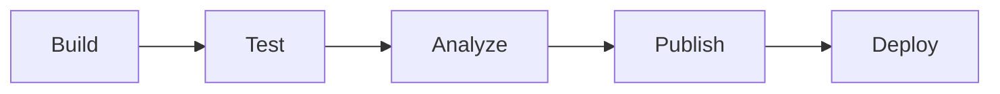

# CI/CD Pipeline Documentation Generator Prompt

> **Purpose**: Copy and paste this prompt into Kiro (or any AI coding assistant) to generate documentation for a project's CI/CD pipeline. The AI will analyze the pipeline configuration, stages, jobs, and deployment targets to produce a document that explains how the pipeline works, how to debug failures, and how to extend it.
>
> **Standards**: Follows CI/CD documentation best practices and your organization's internal documentation standards.

---

## The Prompt

```
I need you to generate comprehensive CI/CD Pipeline Documentation for this project. This document should explain the pipeline stages, what each job does, how to debug failures, and how to extend the pipeline. Follow the process below systematically.

## Phase 1: Pipeline Analysis (Do This First — Report Before Writing)

Analyze the project and report findings. I will confirm before you begin writing.

### 1.1 Pipeline Configuration

Identify:
- **CI/CD platform**: GitLab CI, GitHub Actions, Jenkins, Azure DevOps, etc.
- **Config file location**: `.gitlab-ci.yml`, `.github/workflows/`, `Jenkinsfile`, etc.
- **Pipeline type**: Standard, multi-project, parent-child, matrix, reusable workflows
- **Shared/included configs**: Templates, includes, shared pipelines, reusable workflows
- **Pipeline profiles**: If the pipeline uses external profiles or templates (e.g., shared/organization-wide pipeline profiles)

### 1.2 Stages and Jobs

For each stage, catalog:
- **Stage name**: build, test, analyze, publish, deploy, etc.
- **Jobs in stage**: What jobs run in this stage
- **Job purpose**: What each job does
- **Job triggers**: When each job runs (always, on merge, on tag, manual)
- **Job dependencies**: What must pass before this job runs
- **Job artifacts**: What each job produces (reports, packages, images)
- **Job duration**: Approximate execution time

### 1.3 Environment and Variables

Identify:
- **CI/CD variables**: Variables used in the pipeline (names only, not values)
- **Secret variables**: Variables that contain secrets (marked as protected/masked)
- **Environment-specific variables**: Variables that differ per environment
- **Predefined variables**: Platform-provided variables used in the pipeline

### 1.4 Deployment Configuration

Determine:
- **Deployment targets**: Which environments the pipeline deploys to
- **Deployment method**: Script, Helm, kubectl, rsync, SCP, etc.
- **Deployment triggers**: Automatic on merge, manual approval, tag-based
- **Environment protection**: Approval gates, protected environments
- **Rollback mechanism**: How to rollback a deployment via the pipeline

### 1.5 Quality Gates

Check for:
- **Test execution**: Which test categories run in the pipeline
- **Code coverage**: Coverage thresholds enforced by the pipeline
- **Static analysis**: SonarQube, CodeClimate, Fortify integration
- **Security scanning**: SAST, DAST, dependency scanning, container scanning
- **Code formatting**: Format checks that block the pipeline

### 1.6 Notifications and Reporting

Look for:
- **Failure notifications**: Email, Slack, Teams notifications on failure
- **Status badges**: Pipeline status badges for README
- **Reports**: Test reports, coverage reports, security scan reports
- **Merge request integration**: Pipeline status in MR/PR, required pipeline success

**STOP HERE. Report all findings and wait for my confirmation before proceeding to Phase 2.**

## Phase 2: Generate Pipeline Documentation

After confirmation, generate the document with the following structure. Skip sections that don't apply.

### Document Structure

```markdown
# CI/CD Pipeline Documentation — [Project Name]

## Overview

This document describes the CI/CD pipeline for [Project Name], including pipeline stages, job descriptions, debugging procedures, and extension guidelines.

**Pipeline platform**: [Platform name and version]
**Config location**: `[config file path]`
**Pipeline URL**: [Link to pipeline dashboard]

---

## Pipeline Architecture

### Pipeline Diagram



### Stage Summary

| Stage | Jobs | Trigger | Duration | Purpose |
|-------|------|---------|----------|---------|
| Build | [job names] | [trigger] | [time] | [purpose] |
| Test | [job names] | [trigger] | [time] | [purpose] |
| Analyze | [job names] | [trigger] | [time] | [purpose] |
| Publish | [job names] | [trigger] | [time] | [purpose] |
| Deploy | [job names] | [trigger] | [time] | [purpose] |

---

## Stage Details

### Build Stage

#### Job: [Job Name]

**Purpose**: [What this job does]
**Trigger**: [When it runs — always, on MR, on tag, manual]
**Runner**: [What type of runner executes this job]
**Duration**: [Approximate time]

**What it does**:
1. [Step-by-step description of what the job executes]

**Artifacts produced**:
- [Artifact name and purpose]

**Common failures**:
| Failure | Cause | Fix |
|---------|-------|-----|
| [Error] | [Why] | [How to fix] |

---

[Repeat for each job in each stage]

---

## Pipeline Variables

### Required Variables

| Variable | Purpose | Where Set | Secret? |
|----------|---------|-----------|---------|
| [VAR_NAME] | [purpose] | [project settings / group / file] | [Yes/No] |

### Optional Variables

| Variable | Purpose | Default | When to Override |
|----------|---------|---------|-----------------|
| [VAR_NAME] | [purpose] | [default] | [when] |

**Note**: Secret variable values are never displayed. Only variable names and purposes are documented.

---

## Quality Gates

### What Must Pass Before Merge

- [ ] [Gate 1 — e.g., all unit tests pass]
- [ ] [Gate 2 — e.g., code coverage above threshold]
- [ ] [Gate 3 — e.g., no critical SonarQube issues]
- [ ] [Gate 4 — e.g., security scan clean]

### Coverage Requirements

| Metric | Threshold | Enforcement |
|--------|-----------|-------------|
| [metric] | [threshold] | [how it's enforced] |

---

## Debugging Pipeline Failures

### How to Access Logs

```bash
# [Commands to access pipeline logs — adapt per platform]
[command to list recent pipelines]
[command to get job logs]
```

### Common Pipeline Failures

#### Failure: [Symptom]

**Stage**: [Which stage fails]
**Job**: [Which job fails]
**Error message**:
```
[Typical error output]
```

**Cause**: [Why this happens]
**Fix**: [How to resolve]

---

[Repeat for each common failure]

---

### Reproducing Pipeline Locally

```bash
# How to reproduce what the pipeline does on your local machine
[local equivalent commands for each stage]
```

---

## Deployment

### Deployment Targets

| Environment | Trigger | Approval Required | Rollback |
|-------------|---------|-------------------|----------|
| [env] | [trigger] | [yes/no] | [how] |

### Deployment Process

[Step-by-step description of how deployment works through the pipeline]

### Rollback via Pipeline

[How to trigger a rollback using the pipeline — rerun previous pipeline, manual job, revert and redeploy]

---

## Extending the Pipeline

### Adding a New Job

1. [Where to add the job definition]
2. [How to configure the stage, trigger, and dependencies]
3. [How to test the new job]

### Adding a New Stage

1. [Where to define the new stage]
2. [How to order it relative to existing stages]
3. [How to add jobs to the new stage]

### Using Pipeline Templates/Includes

[How the project uses shared pipeline templates and how to extend them]

---

## Pipeline Maintenance

### Updating Pipeline Dependencies

[How to update runner images, tool versions, or shared templates]

### Pipeline Performance

[Tips for keeping the pipeline fast — caching, parallelism, conditional execution]

---

## References

- **Pipeline config**: `[config file path]`
- **Pipeline dashboard**: [URL]
- **Shared templates**: [URL or path to shared pipeline configs]
- **Platform documentation**: [Link to CI/CD platform docs]

---

*Last Updated: [DATE]*
```

## Phase 3: Validation

After generating the document, verify:

### Pipeline Documentation Validation
- [ ] All stages and jobs match the actual pipeline configuration
- [ ] Job descriptions accurately reflect what each job does
- [ ] Pipeline diagram matches the actual stage flow
- [ ] Variables list includes all significant variables (no secret values)
- [ ] Quality gates match the actual pipeline enforcement
- [ ] Debugging commands are real and would work
- [ ] Common failures are realistic (derived from actual pipeline behavior)
- [ ] Deployment targets match the actual environments
- [ ] No secrets, tokens, or credentials appear anywhere
- [ ] Links to pipeline dashboard and platform docs are correct

## Rules

1. **Read the actual pipeline config** — derive stages, jobs, and triggers from the real config
2. **Read shared/included configs** — understand what's inherited from templates
3. **Don't expose secrets** — document variable names and purposes, never values
4. **Be specific about commands** — exact commands for debugging, not "check the logs"
5. **Include common failures** — pipeline failures are the most common developer frustration
6. **Include local reproduction** — developers need to reproduce pipeline behavior locally
7. **Link to platform docs** — for platform-specific features, link to official documentation
8. **Pause for confirmation** — after Phase 1 analysis, stop and wait before writing

## Reference Files

When generating this document, consult these project files if they exist:
- `.gitlab-ci.yml` / `.github/workflows/` / `Jenkinsfile` — Pipeline configuration
- `pom.xml` / `package.json` — Build commands referenced by the pipeline
- `Makefile` — Build/test shortcuts used in pipeline jobs
- `docs/architecture/10-tech-stack-summary.md` — CI/CD pipeline description
- `.kiro/steering/glab.md` — GitLab CLI for pipeline debugging
- `.kiro/skills/glab-cli-operations/SKILL.md` — Pipeline log analysis commands
- `README.md` — Pipeline status badge configuration

## Organization Standards Reference

Standards and templates are maintained in your organization's standards repository (set its location for your team). Referenced files:
- `skills/glab-cli-operations/SKILL.md` — GitLab CLI pipeline operations and log analysis
- `steering/glab.md` — Non-interactive pipeline debugging commands
- `steering/java-standards.md` — Build and test standards referenced by pipeline
- `steering/junit5-tag-strategy.md` — Test categorization used in pipeline stages
```

---

## Usage Notes

### How to Use This Prompt

1. Open any project in your AI coding assistant
2. Copy the entire prompt above (everything between the outer triple backticks)
3. Paste it into the chat
4. The AI will analyze the pipeline, report findings, and wait for confirmation
5. After confirmation, it generates the pipeline documentation

### Output Location

| Output | Suggested Location |
|---|---|
| Pipeline Documentation | `docs/cicd/pipeline.md` or `docs/CI_CD.md` |

### Relationship to Other Prompts

- **Developer Onboarding prompt** (`docs/prompts/developer-onboarding-guide-prompt.md`) — Onboarding guide references the pipeline; this explains it in detail
- **Runbook prompt** (`docs/prompts/runbook-prompt.md`) — Runbooks cover deployment procedures; this covers the pipeline mechanics
- **Test Strategy prompt** (`docs/prompts/test-strategy-prompt.md`) — Test strategy covers what tests run; this covers how they run in CI
- **This prompt** — Generates comprehensive CI/CD pipeline documentation

---

**Last Updated**: 2026-04-23 (CST)
